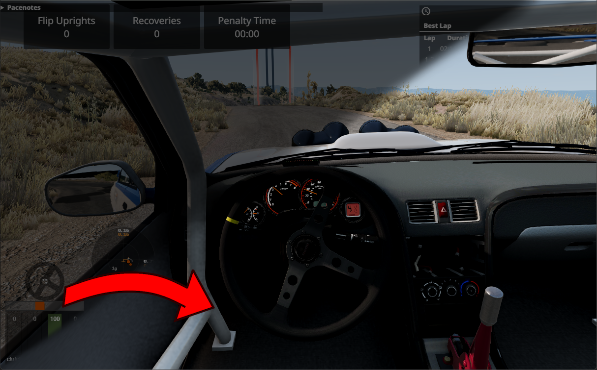
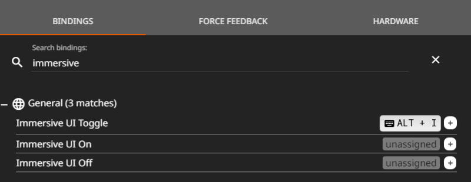

# BeamNG Immersive UI (Auto hide UI)

This mod automatically hides the UI in BeamNG when you’re driving with the in-car camera, giving you a cleaner, more immersive experience. It's perfect for VR setups or full sim rigs, allowing you to focus on the road without distractions while still having the UI available when needed. Unlike simply hiding the UI with Alt + U, this mod automatically restores it when accessing menus or stopping the vehicle.

## How It Works:

The UI hides when all conditions are met:

- You're on the driver camera
- No menus are open
- Your vehicle speed exceeds **10 kph**
- You're not in a replay

The UI reappears when:

- Your speed drops below **1 kph** for more than **1 second**
- A menu is opened

This mod ensures you get a distraction-free driving experience while still letting you see the UI when necessary. Perfect for those who love a realistic HUD-free view while racing or cruising!

### Keybinds
You can also bind keys to disable and reenable the immersive UI for when you need the UI to stay visible.

